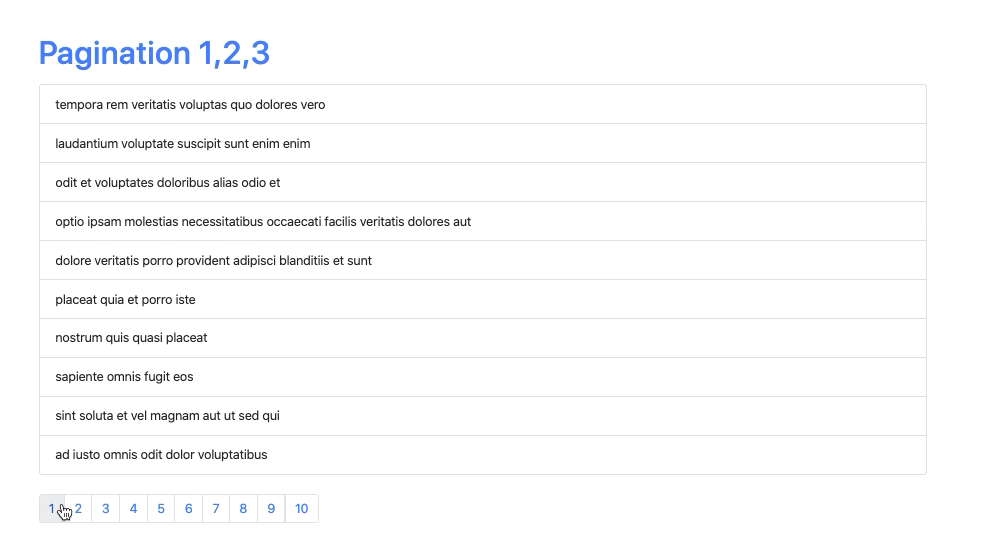

### Pagination with [tutorial](https://www.youtube.com/watch?v=IYCa1F-OWmk)

This repo about simple example of pagination

```javascript
const Pagination = ({postsPerPage, totalPosts, paginate}) => {
    const pageNumbers = [];

    for (let i = 1; i <= Math.ceil(totalPosts / postsPerPage); i++) {
        pageNumbers.push(i);
    }

    return (
        <nav>
            <ul className='pagination'>
                {pageNumbers.map(number => (
                    <li key={number} className='page-item'>
                        <a onClick={() => paginate(number)} href='!#' className='page-link'>
                            {number}
                        </a>
                    </li>
                ))}
            </ul>
        </nav>
    );
};
export default Pagination;
```

Demo
----

```console
$ yarn start
```

Open your browser and go to [http://localhost:3000/](http://localhost:3000/)


